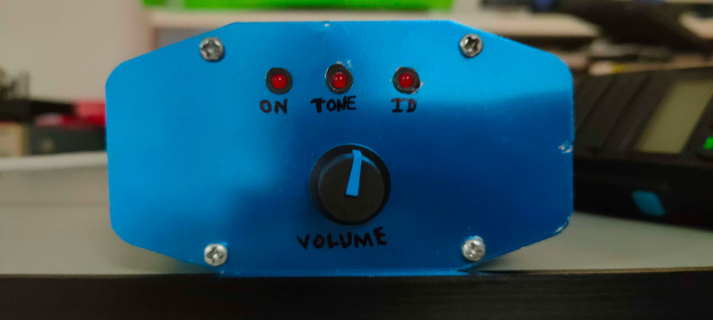
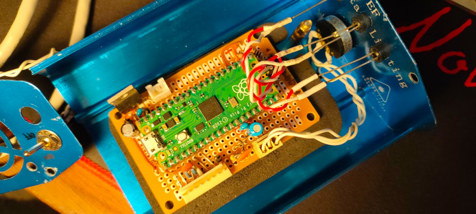
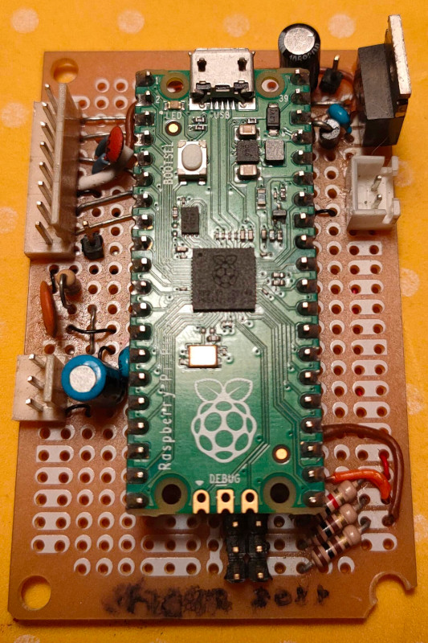

# YAESU DR-1X/DR-2X VOICE ID 

This project is a design of a Voice ID board for the YAESU DR-1X and 
DR-2X repeater models.

These repeaters do have a morse id feature and by using the FVS-2 voice module
they can do a very limited voice identification function which will synthetize
the repeater callsign and nothing else.

These repeaters provide a CONTROL I/O port with 15 pins and a ACC port with 10 
pins.

Both can be used but there is no documentation regarding the ACC serial data protocol.

## Hardware

This project is based around the Raspberry Pi Pico (RP2040). It uses some digital
GPIOs to control the repeater for voice identification purposes. The advantage of using the Pico and specially the Python SDK is that the filesystem is already there amongst others.

Via the Control IO port we can get many control signals from the repeater and the
logic interface is direct with not so many discrete components.

The circuit can be powered from usb and from the radio, simultaneaously if needed.

The circuit is simple. A regulator for voltage control, leds and the resistor divider
for volume control with a simple 1st order RC filter.

### Pictures

- Inside the box

- A more detailed look at the PCB

### Schematic

The schematic is adapted to the real implementation in real life, that's why,
eg, the volume potentiometer appears as a JST/KK/Molex 3 pin conector.

**Check the PDFs for the schematic.**

### Yaesu DR1-X

The Yaesu DR1X has some design flaws in the controller board.

From the technical manual we can see that some transistor were not fitted and
some resistor values were incorrect, eg, the 0 ohm resitor in the CTCSS zener protector.

#### Control IO Pinout

|Pin No|Pin Name|I/O Descriptions|
|------|--------|----------------|
|1|EXT I/O|Input [L] GND: Remote mode   [H] OPEN: Repeater mode|
|2|PTT|Input [L] GND: EXT PTT ON   [H] OPEN: EXT PTT OFF When this pin is pulled low by an external device, it keys the repeater transmitter. |
|3|CTCSS/DCS (PKSQL)|Output [L] GND: Decoded   [H] OPEN: Un-decoded / Signaling settings in the repeater setup menu will be applied.|
|4|SQL DET (Noise SQL)|Output [L] GND: SQL open   [H] OPEN: SQL close / This is an open-collector, active-low output capable of sinking about 10 mA. It indicates that the receiver squelch is open. If the squelch control is properly set, this indicates a carrier on the receiver channel.|
|5|GND|GND Chassis ground for all logic levels and power supply return |
|6|TONE IN|Input CTCSS/DCS EXT input / 600 ohm, 500 mV peak to peak, Valid during external PTT control. This pin is sub-audible tone input, and has a flat response characteristic (repeater deviation is constant for a given signal level over the frequency range of 5 ~ 250 Hz). Injecting a too high signal level here causes over-deviation of CTCSS or DCS, degrading performance. Use shielded cable to connect to this pin, connecting the shield to GND.
|7|AF IN|Input EXT Modulation input / 600 ohm, 1.5 V peak to peak / Valid during external PTT control / This pin is audio input (300 ~ 3,000 Hz). This audio is injected before the splatter filter stage, so excess signal input levels are clipped. It is impossible to input analog modulation signals and convert them to digital signals on DR-1X/DR-1XE. Use shielded cable to connect to this pin, and connect the shield to GND.
|8|DISC OUT|Output Up-link RX DISC output (w/o de-emphasis), 500 mV peak to peak / Discriminator output during up-link reception. Does not affect the operation mode of the repeater. The signal is extracted before the de-emphasis and squelch circuitry. **Use shielded cable to connect to this pin, and connect the shield to GND.**|
|9|AF OUT|Output Up-link RX AF output (w/ de-emphasis), 300 mV peak to peak Analog audio output during up-link reception. Does not affect the operation mode of the repeater. This pin is an output for AF signal (300 mVp-p), being extracted after the de-emphasis. Demodulated digital signals can be output as well.
|10|GND|GND Chassis ground for all logic levels and power supply return|
|11|EXT1 *|Input. In Remote mode, the logic combination of Ports EXT1 and EXT2 determines the transmit and receive modes|
|12|EXT2 *|Input. **Check table below**|
|13|EXT3 *|Input [L] GND: RX Tone OFF   [H] OPEN: Setup mode. Input a low level signal to indicate that the receiving tone is invalid.|
|14|EXT4 *|Input [L] GND: TX Tone OFF   [H] OPEN: Setup mode. Input a low level signal to indicate that the transmitting tone is invalid.|
|15|VCC|VCC Power supply. This pin provides 13.8 V, 2.0 A, DC from the repeater supply. There is an internal 3 A fuse to prevent damage to the repeater.|

\*) *These functions may only be activated while the repeater is in Remote mode.*

|Port 2|Port 1|RX|TX|
|------|------|---|---|
|H|H|Auto (AMS)|FM|
|H|L|FM|FM|
|L|H|Digital|Digital|
|L|L|Auto (AMS)|Auto (AMS|

## Links

- https://ww8tf.club/yaesu-dr-1x-repeater-modification-common-concerns/
- http://c4fm.xyz/c4fm-radios/yaesu-dr-1-c4fm.php
- https://www.vk6uu.id.au/fusion-front.html
- https://www.arcomcontrollers.com/index.php/rc210/rc210-board
- http://www.repeater-builder.com/yvs/vxr-1000-to-dr-1x.html
- http://hamlabs.no/2015/05/28/interfacing-the-dr-1x-repeater/
- https://openrepeater.com/
- https://ics-ctrl.com/
- http://www.kk4ice.com/?page_id=621
- https://www.masterscommunications.com/products/radio-adapter/radr1x.html

